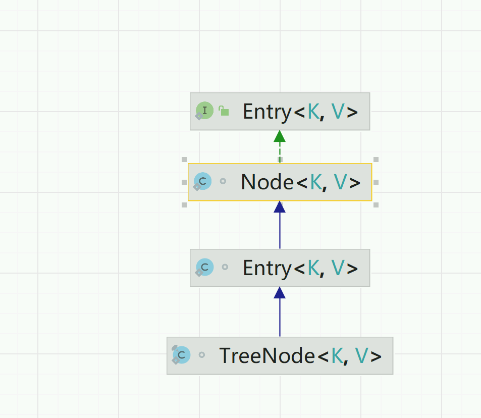

Hashmap源码解析

# 一、Hashmap数据结构

哈希表是一种以键 - 值（key-value）存储数据的结构，我们只要输入待查找的值即 key，就可以找到其对应的值即 Value。哈希的思路很简单，把值放在数组里，用一个哈希函数把 key 换算成一个确定的位置，然后把 value 放在数组的这个位置。


比如上图中，一共有13个桶0-12，当哈希值是01时，就会被放到1桶中，如果是14，对13取模之后也是1，所以也会被放到1桶中。由于1桶有两个数据，就会形成一个链表。

这里需要注意的是，如果链表大小超过阈值（TREEIFY_THRESHOLD, 8），图中的链表就会被改造为树形结构。如果链表长度超过阈值( TREEIFY THRESHOLD==8)，就把链表转成红黑树，链表长度低于6，就把红黑树转回链表。

JDK版本	实现方式	节点数>=8	节点数<=6
1.8以前	数组+单向链表	数组+单向链表	数组+单向链表
1.8以后	**数组+单向链表+红黑树**	数组+红黑树	数组+单向链表

### Node结构

HashMap底层**由Node[]数组组**成，其中**Node本身是一个单向链表的节点**，它有**一个子类是红黑树的节点类型**。

```java
//Node是Map.Entry接口的实现类
//在此存储数据的Node数组容量是2次幂
//每一个Node本质都是一个单向链表
transient Node<K,V>[] table;

static class Node<K,V> implements Map.Entry<K,V> {
static class Entry<K,V> extends HashMap.Node<K,V> {
static final class TreeNode<K,V> extends LinkedHashMap.Entry<K,V> {
```

```java
static class Node<K,V> implements Map.Entry<K,V> {
    final int hash;
    final K key;
    V value;
    Node<K,V> next;
}    

static final class TreeNode<K,V> extends LinkedHashMap.Entry<K,V> {
    TreeNode<K,V> parent;  // red-black tree links
    TreeNode<K,V> left;
    TreeNode<K,V> right;
    TreeNode<K,V> prev;    // needed to unlink next upon deletion
    boolean red;
```




# 二、Hashmap源码-初始化

从非拷贝构造函数的实现来看，Hashmap的数据似乎并没有在最初就初始化好，仅仅设置了一些初始值而已。

```java
//这两个是限定值 当节点数大于8时会转为红黑树存储
static final int TREEIFY_THRESHOLD = 8;
//当节点数小于6时会转为单向链表存储
static final int UNTREEIFY_THRESHOLD = 6;
//红黑树最小长度为 64
static final int MIN_TREEIFY_CAPACITY = 64;
//HashMap容量初始大小
static final int DEFAULT_INITIAL_CAPACITY = 1 << 4; // aka 16
//HashMap容量极限
static final int MAXIMUM_CAPACITY = 1 << 30;
//负载因子默认大小
static final float DEFAULT_LOAD_FACTOR = 0.75f;
//Node是Map.Entry接口的实现类
//在此存储数据的Node数组容量是2次幂
//每一个Node本质都是一个单向链表
transient Node<K,V>[] table;
//HashMap大小,它代表HashMap保存的键值对的多少
transient int size;
//HashMap被改变的次数
transient int modCount;
//下一次HashMap扩容的大小
int threshold;
//存储负载因子的常量
final float loadFactor;
```

## 构造方法

```java
//默认的构造函数
public HashMap() {
    this.loadFactor = DEFAULT_LOAD_FACTOR; // all other fields defaulted
}
//指定容量大小
public HashMap(int initialCapacity) {
    this(initialCapacity, DEFAULT_LOAD_FACTOR);
}
//指定容量大小和负载因子大小
public HashMap(int initialCapacity, float loadFactor) {
    //指定的容量大小不可以小于0,否则将抛出IllegalArgumentException异常
    if (initialCapacity < 0)
        throw new IllegalArgumentException("Illegal initial capacity: " +
                                           initialCapacity);
    //判定指定的容量大小是否大于HashMap的容量极限
    if (initialCapacity > MAXIMUM_CAPACITY)
        initialCapacity = MAXIMUM_CAPACITY;
    //指定的负载因子不可以小于0或为Null，若判定成立则抛出IllegalArgumentException异常
    if (loadFactor <= 0 || Float.isNaN(loadFactor))
        throw new IllegalArgumentException("Illegal load factor: " +
                                           loadFactor);

    this.loadFactor = loadFactor;
    // 设置“HashMap阈值”，当HashMap中存储数据的数量达到threshold时，就需要将HashMap的容量加倍。
    //tableSizeFor用于查找到大于给定数值的最近2次幂值，比如给定18就是32。给定33就是64。
    this.threshold = tableSizeFor(initialCapacity);
}
//传入一个Map集合,将Map集合中元素Map.Entry全部添加进HashMap实例中
public HashMap(Map<? extends K, ? extends V> m) {
    this.loadFactor = DEFAULT_LOAD_FACTOR;
    //此构造方法主要实现了Map.putAll()
    putMapEntries(m, false);
}
```

### HashMap构造方法文字版√

HashMap实现了**懒惰初始化**，在**构造方法中仅仅计算了 table 的大小**，以后在**首次使用时（即put时）才会真正创建（拷贝构造函数除外）

> 注： 在java源码中绝大部分的代码都采用了懒惰初始化的方式来构造。

## put方法

我们去看看 put 方法实现，似乎只有一个 **putVal 的调用**：

```java
public V put(K key, V value) {
    return putVal(hash(key), key, value, false, true);
}
```

然后就来看putVal方法内部：

```java
public V put(K key, V value) {
    return putVal(hash(key), key, value, false, true);
}

//HashMap.put的具体实现
final V putVal(int hash, K key, V value, boolean onlyIfAbsent,
               boolean evict) {
    Node<K,V>[] tab; Node<K,V> p; int n, i;
    //判定table不为空并且table长度不可为0,否则将从resize函数中获取
    if ((tab = table) == null || (n = tab.length) == 0)
        n = (tab = resize()).length;
    //这样写法有点绕,其实这里就是通过索引获取table数组中的一个元素看是否为Null
    if ((p = tab[i = (n - 1) & hash]) == null)
        //若判断成立,则New一个Node出来赋给table中指定索引下的这个元素
        tab[i] = newNode(hash, key, value, null);
    else {  //若判断不成立
        Node<K,V> e; K k;
        //对这个元素进行Hash和key值匹配
        if (p.hash == hash &&
            ((k = p.key) == key || (key != null && key.equals(k))))
            e = p;
        else if (p instanceof TreeNode) //如果数组中德这个元素P是TreeNode类型
            //判定成功则在红黑树中查找符合的条件的节点并返回此节点
            e = ((TreeNode<K,V>)p).putTreeVal(this, tab, hash, key, value);
        else { //若以上条件均判断失败，则执行以下代码
            //向Node单向链表中添加数据
            for (int binCount = 0; ; ++binCount) {
                if ((e = p.next) == null) {
                    p.next = newNode(hash, key, value, null);
                    //若节点数大于等于8
                    if (binCount >= TREEIFY_THRESHOLD - 1) // -1 for 1st
                        //转换为红黑树
                        treeifyBin(tab, hash);
                    break;
                }
                if (e.hash == hash &&
                    ((k = e.key) == key || (key != null && key.equals(k))))
                    break;
                p = e; //p记录下一个节点
            }
        }
        // 如果存在旧值e，通过onlyIfAbsent是否为false（默认为false）决定是否覆盖
        if (e != null) { // existing mapping for key
            V oldValue = e.value;
            if (!onlyIfAbsent || oldValue == null)
                e.value = value;
            afterNodeAccess(e);
            return oldValue;
        }
    }
    ++modCount;
    if (++size > threshold) //判断是否需要扩容
        resize();
    afterNodeInsertion(evict);
    return null;
}
```

### HashMap put方法文字版

1. 首先获取Node数组table对象和长度，**若table为null或长度为0，则调用resize()扩容方法**获取table最新对象，并通过此对象获取长度大小；**hashmap的node数组是在第一次put时才构造的，懒加载。**

2. 判定**数组中指定索引下的节点是否为Null**，若为Null ,则new出一个单向链表赋给table中索引下的这个节点

3. 若判定**数组索引的节点不为Null**,我们的判断再做分支

   1. 比较**数组索引的节点p**和插入的key是否是相等，若判定成功直接赋予e（e用于返回put后，一个key的的旧值，如果没有则为null）
      - 判断相等的方式：
        - 通过比较数组索引的节点p的**hash值是否和插入key的hash值相等**，
        - 然后判断 数组索引的节点p的key值是否和插入的key值相等
   2. 若匹配判定失败,则进行**类型匹配是否为TreeNode** ；若判定成功则在红黑树中查找符合条件的节点并将其回传赋给e

   3. 若以上判定全部失败则进行最后操作,向**单向链表中添加数据**；若单向链表的长度大于等于8,则 进入treeifyBin(tab, hash)方法，记录下一个节点,对e进行判定若成功则返回旧值
        - 如果 Node数组长度 < 64,则进行扩容
        - 当Node数组长度 》= 64,则将链表转为红黑树
   4. 如果存在旧值e，通过onlyIfAbsent是否为false（默认为false）决定是否覆盖

4. 最后判定数组大小需不需要扩容： 如果超过阈值（数组长度*loadFactor（默认0.75=3/4）），就扩容

# 三、Hashmap源码-hash方法

```java
static final int hash(Object key) {
    int h;
    return (key == null) ? 0 : (h = key.hashCode()) ^ (h >>> 16);
}
```

## 为什么HashMap可以存key为null的key

从HashMap的hash方法就能知道了，因为**通过hash(key)计算获取key的hash值时，如果key为null直接返回为0**


具体键值对在哈希表中的位置（数组 index）取决于下面的位运算：

i = (n - 1) & hash
1
仔细观察哈希值的源头，我们会发现，它并不是 key 本身的 hashCode，而是来自于 HashMap 内部的另外一个 hash 方法。注意，为什么这里需要将高位数据移位到低位进行异或运算呢？这是因为有些数据计算出的哈希值差异主要在高位，而 HashMap 里的哈希寻址是忽略容量以上的高位的，那么这种处理就可以有效避免类似情况下的哈希碰撞。


参考资料：

https://blog.csdn.net/caimengyuan/article/details/61204542

# 四、Hashmap源码-resize方法

```java
//重新设置table大小/扩容 并返回扩容的Node数组即HashMap的最新数据
final Node<K,V>[] resize() {
    Node<K,V>[] oldTab = table; //table赋予oldTab作为扩充前的table数据
    int oldCap = (oldTab == null) ? 0 : oldTab.length; 
    int oldThr = threshold;
    int newCap, newThr = 0;
    if (oldCap > 0) {
        //判定数组是否已达到极限大小，若判定成功将不再扩容，直接将老表返回
        if (oldCap >= MAXIMUM_CAPACITY) {
            threshold = Integer.MAX_VALUE;
            return oldTab;
        }
        //若新表大小(oldCap*2)小于数组极限大小 并且 老表大于等于数组初始化大小
        else if ((newCap = oldCap << 1) < MAXIMUM_CAPACITY &&
                 oldCap >= DEFAULT_INITIAL_CAPACITY)
            //旧数组大小oldThr 经二进制运算向左位移1个位置 即 oldThr*2当作新数组的大小
            newThr = oldThr << 1; // double threshold
    }
    //若老表中下次扩容大小oldThr大于0
    else if (oldThr > 0)
        newCap = oldThr;  //将oldThr赋予控制新表大小的newCap
    else { //若其他情况则将获取初始默认大小
        newCap = DEFAULT_INITIAL_CAPACITY;
        newThr = (int)(DEFAULT_LOAD_FACTOR * DEFAULT_INITIAL_CAPACITY);
    }
    //若新表的下表下一次扩容大小为0
    if (newThr == 0) {  
        float ft = (float)newCap * loadFactor;  //通过新表大小*负载因子获取
        newThr = (newCap < MAXIMUM_CAPACITY && ft < (float)MAXIMUM_CAPACITY ?
                  (int)ft : Integer.MAX_VALUE);
    }
    threshold = newThr; //下次扩容的大小
    @SuppressWarnings({"rawtypes","unchecked"})
    Node<K,V>[] newTab = (Node<K,V>[])new Node[newCap];
    table = newTab; //将当前表赋予table
    if (oldTab != null) { //若oldTab中有值需要通过循环将oldTab中的值保存到新表中
        for (int j = 0; j < oldCap; ++j) {
            Node<K,V> e;
            if ((e = oldTab[j]) != null) {//获取老表中第j个元素 赋予e
                oldTab[j] = null; //并将老表中的元素数据置Null
                if (e.next == null) //若此判定成立 则代表e的下面没有节点了
                    newTab[e.hash & (newCap - 1)] = e; //将e直接存于新表的指定位置
                else if (e instanceof TreeNode)  //若e是TreeNode类型
                    //分割树，将新表和旧表分割成两个树，并判断索引处节点的长度是否需要转换成红黑树放入新表存储
                    ((TreeNode<K,V>)e).split(this, newTab, j, oldCap);
                else { // preserve order
                    Node<K,V> loHead = null, loTail = null; //存储与旧索引的相同的节点
                    Node<K,V> hiHead = null, hiTail = null; //存储与新索引相同的节点
                    Node<K,V> next;
                    //通过Do循环 获取新旧索引的节点
                    do {
                        next = e.next;
                        if ((e.hash & oldCap) == 0) {
                            if (loTail == null)
                                loHead = e;
                            else
                                loTail.next = e;
                            loTail = e;
                        }
                        else {
                            if (hiTail == null)
                                hiHead = e;
                            else
                                hiTail.next = e;
                            hiTail = e;
                        }
                    } while ((e = next) != null);
                    //通过判定将旧数据和新数据存储到新表指定的位置
                    if (loTail != null) {
                        loTail.next = null;
                        newTab[j] = loHead;
                    }
                    if (hiTail != null) {
                        hiTail.next = null;
                        newTab[j + oldCap] = hiHead;
                    }
                }
            }
        }
    }
    //返回新表
    return newTab;
}
```

1. 判定数组是否已达到极限大小，若判定成功将不再扩容，直接将老表返回


2. 若新表大小(oldCap2)小于数组极限大小&老表大于等于数组初始化大小 判定成功则 旧数组大小oldThr 经二进制运算向左位移1个位置 即 oldThr2当作新数组的大小
   2.1. 若[2]的判定不成功，则继续判定 oldThr （代表 老表的下一次扩容量）大于0，若判定成功 则将oldThr赋给newCap作为新表的容量
   
   2.2 若 [2] 和[2.1]判定都失败,则走默认赋值 代表 表为初次创建

3.确定下一次表的扩容量, 将新表赋予当前表

4.**通过for循环将老表中的值存入扩容后的新表中**

​	4.1 获取旧表中指定索引下的Node对象 赋予e 并将旧表中的索引位置数据置空

​	4.2 若**e的下面没有其他节点**则将e直接赋到新表中的索引位置

​	4.3 若e的类型为TreeNode红黑树类型

​		 4.3.1 分割树，将新表和旧表分割成两个树，并判断索引处节点的长度是否需要转换成红黑树放入新表存储

​		4.4 e的类型为Node链表节点：（else其他）

 			4.4.2 通过Do循环 不断获取新旧索引的节点
 	
 			4.4.3 通过判定将**旧数据和新数据**存储到新表指定的位置

**为什么区分新旧数据：**

原数组的元素在重新计算hash之后，因为数组容量n变为2倍，那么n-1的mask范围在高位多1bit。在元素拷贝过程不需要重新计算元素在数组中的位置，只需要看看原来的hash值新增的那个bit是1还是0，**是0的话索引没变，是1的话索引变成“原索引+oldCap”（根据`e.hash & oldCap == 0`判断）** 。这样可以省去重新计算hash值的时间，而且由于新增的1bit是0还是1可以认为是随机的，因此resize的过程会均匀的把之前的冲突的节点分散到新的bucket。


门限值等于（负载因子）x（容量），如果构建 HashMap 的时候没有指定它们，那么就是依据相应的默认常量值。

门限通常是以倍数进行调整 （newThr = oldThr << 1），我前面提到，根据 putVal 中的逻辑，当元素个数超过门限大小时，则调整 Map 大小。

扩容后，需要将老的数组中的元素重新放置到新的数组，这是扩容的一个主要开销来源。


————————————————
版权声明：本文为CSDN博主「码农小白猿」的原创文章，遵循CC 4.0 BY-SA版权协议，转载请附上原文出处链接及本声明。
原文链接：https://blog.csdn.net/xadasss/article/details/116793267

## 五、Hashmap源码-负载因子

前面我们快速梳理了一下 HashMap 从创建到放入键值对的相关逻辑，现在思考一下，为什么我们需要在乎容量和负载因子呢？

这是因为容量和负载系数决定了可用的桶的数量，空桶太多会浪费空间，如果使用的太满则会严重影响操作的性能。极端情况下，假设只有一个桶，那么它就退化成了链表，完全不能提供所谓常数时间存的性能。

既然容量和负载因子这么重要，我们在实践中应该如何选择呢？

如果能够知道 HashMap 要存取的键值对数量，可以考虑预先设置合适的容量大小。具体数值我们可以根据扩容发生的条件来做简单预估，根据前面的代码分析，我们知道它需要符合计算条件：

 负载因子 * 容量 > 元素数量
1
所以，预先设置的容量需要满足，大于“预估元素数量 / 负载因子”，同时它是 2 的幂数，结论已经非常清晰了。

如果没有特别需求，不要轻易进行更改，因为 JDK 自身的默认负载因子是非常符合通用场景的需求的。
如果确实需要调整，建议不要设置超过 0.75 的数值，因为会显著增加冲突，降低 HashMap 的性能。
如果使用太小的负载因子，按照上面的公式，预设容量值也进行调整，否则可能会导致更加频繁的扩容，增加无谓的开销，本身访问性能也会受影响。
六、面试问题
1、拉链法导致的链表过深问题为什么不用二叉查找树代替，而选择红黑树？为什么不一直使用红黑树？
之所以选择红黑树是为了解决二叉查找树的缺陷，二叉查找树在特殊情况下会变成一条线性结构（这就跟原来使用链表结构一样了，造成很深的问题），遍历查找会非常慢。而红黑树在插入新数据后可能需要通过左旋，右旋、变色这些操作来保持平衡，引入红黑树就是为了查找数据快，解决链表查询深度的问题，我们知道红黑树属于平衡二叉树，但是为了保持“平衡”是需要付出代价的，但是该代价所损耗的资源要比遍历线性链表要少，所以当长度大于8的时候，会使用红黑树，如果链表长度很短的话，根本不需要引入红黑树，引入反而会慢。

2、说说你对红黑树的见解？


1、每个节点非红即黑

2、根节点总是黑色的

3、如果节点是红色的，则它的子节点必须是黑色的（反之不一定）

4、每个叶子节点都是黑色的空节点（NIL节点）

成很深的问题），遍历查找会非常慢。而红黑树在插入新数据后可能需要通过左旋，右旋、变色这些操作来保持平衡，引入红黑树就是为了查找数据快，解决链表查询深度的问题，我们知道红黑树属于平衡二叉树，但是为了保持“平衡”是需要付出代价的，但是该代价所损耗的资源要比遍历线性链表要少，所以当长度大于8的时候，会使用红黑树，如果链表长度很短的话，根本不需要引入红黑树，引入反而会慢。

2、说说你对红黑树的见解？
1、每个节点非红即黑

2、根节点总是黑色的

3、如果节点是红色的，则它的子节点必须是黑色的（反之不一定）

4、每个叶子节点都是黑色的空节点（NIL节点）

5、从根节点到叶节点或空子节点的每条路径，必须包含相同数目的黑色节点（即相同的黑色高度）
————————————————
版权声明：本文为CSDN博主「码农小白猿」的原创文章，遵循CC 4.0 BY-SA版权协议，转载请附上原文出处链接及本声明。
原文链接：https://blog.csdn.net/xadasss/article/details/116793267